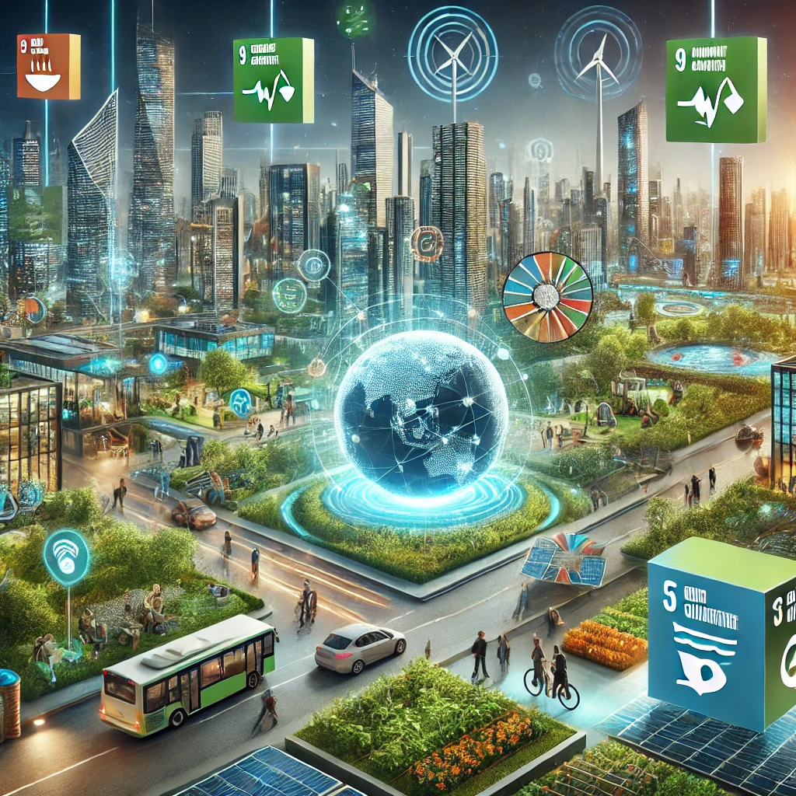

## 🌍 **1.2.1 Selección de los ODS más Relevantes y Justificación**

### 🌟 **ODS Claves para la Informática y las Comunicaciones**

El sector de la informática y las comunicaciones desempeña un papel crucial en la consecución de diversos **Objetivos de Desarrollo Sostenible (ODS)**. A continuación, se presentan los más relevantes para esta industria:

- 🎯 **ODS 9: Industria, Innovación e Infraestructura**  
  - 💡 **Justificación:** La informática impulsa el desarrollo de infraestructuras digitales, fomenta la innovación en soluciones tecnológicas y mejora la eficiencia operativa en múltiples sectores.

- 🌱 **ODS 13: Acción por el Clima**  
  - ♻ **Justificación:** Las tecnologías de la información permiten la **monitorización y reducción de las emisiones de carbono**, contribuyendo a la sostenibilidad ambiental mediante soluciones como la inteligencia artificial y el Internet de las Cosas (IoT).

- 🤝 **ODS 17: Alianzas para Lograr los Objetivos**  
  - 🔗 **Justificación:** Las TIC facilitan la colaboración global y la creación de redes de conocimiento, impulsando **sinergias entre empresas, gobiernos y comunidades** para alcanzar metas de desarrollo sostenible.

---

🌟 ***El impacto de la tecnología en el desarrollo sostenible es innegable. La innovación y la digitalización son clave para construir un futuro mejor.***

⬅ [Anterior Página](1.2_ODS%20más%20relevantes%20de%20Nuestro%20Sector%20Productivo.md) | 📖 [Índice](indice_pisa3_D_Gilabert1.md) | [Siguiente Página ➡](1_capitulo1_ra3_pisa3_D_Gilabert1\1.2.2_Objetivos_y_metas_específicas_de_los_ODS_aplicables_a_Nuestro_Sector_Productivo.md)
