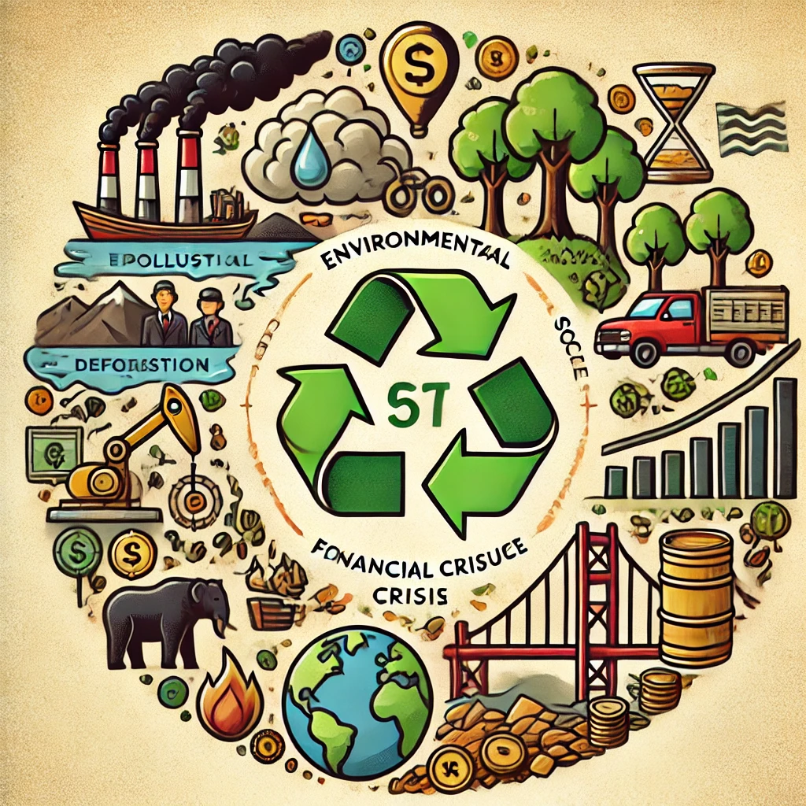

2.1 Identificación de riesgos ambientales, sociales y económicos

Los riesgos ambientales, sociales y económicos afectan la sostenibilidad de las empresas y comunidades. Es fundamental analizarlos para implementar estrategias que minimicen su impacto y maximicen las oportunidades de desarrollo.




## Riesgos Ambientales
- **Cambio climático** 🌍
- **Contaminación del agua y aire** 💨
- **Pérdida de biodiversidad** 🦜

A. Riesgos ambientales

Los riesgos ambientales derivan de la actividad humana y pueden comprometer la biodiversidad y el equilibrio ecológico.

- Cambio climático: Aumento de temperatura global y eventos extremos.

- Pérdida de biodiversidad: Extinción de especies y degradación de ecosistemas.

- Contaminación del agua y el aire: Afecta la salud pública y el medio ambiente.

B.  Riesgos sociales

1. La sostenibilidad también implica considerar el impacto en las personas y las comunidades.

2. Desigualdad de oportunidades: Falta de acceso equitativo a recursos.

3. Condiciones laborales precarias: Falta de seguridad y salarios justos.

4. Desplazamiento de comunidades: Impacto de megaproyectos sin regulación.

C. Riesgos económicos
```markdown
Las crisis financieras pueden afectar la estabilidad del mercado y la inversión en sostenibilidad.
```
Los riesgos económicos incluyen fluctuaciones del mercado y dependencia de recursos no renovables.

"Un enfoque preventivo minimiza riesgos y garantiza la sostenibilidad."

🔗 Más información sobre riesgos ambientales https://www.unep.org/

---
🔙 [Volver al índice principal](2_Riesgos_y_oportunidades_asociados_a_los_ODS_más_relevantes_de_Nuestro_Sector_Productivo_nuño.md)
➡️ [Siguiente: Digitalización](2.2_Oportunidades_de_mejora_e_innovación_sostenible_nuño.md)

---

| Tipo de Riesgo | Ejemplo                  |
| -------------- | ------------------------ |
| Ambiental      | Contaminación industrial |
| Social         | Discriminación laboral   |
| Económico      | Recesión económica       |
