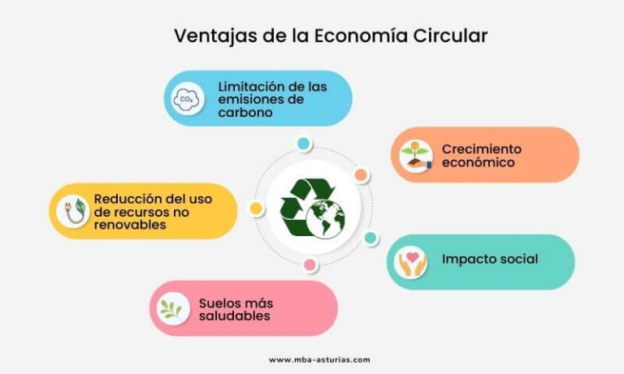

# 2.2.1 Integración de la Economía Circular como Ventaja Competitiva

## Introducción
El modelo circular transforma residuos en recursos, reduciendo la presión sobre el medio ambiente y fomentando modelos de negocio sostenibles.

---
## Principios
- **Diseño sostenible** 🎨: Incorporación de materiales reciclables en el diseño de productos.
- **Uso prolongado de productos** ⏳: Estrategias para alargar la vida útil de bienes de consumo.
- **Energías renovables** ☀️: Implementación de fuentes limpias para la producción.

> "La economía circular no es una tendencia, es una necesidad económica y ecológica." - Investigadores

## Aplicaciones
1. **Empresas de reciclaje** ♻️: Crecimiento de mercados de productos reutilizados.
2. **Materiales biodegradables** 🌱: Reducción de plásticos de un solo uso.
3. **Sistemas de logística inversa** 🚛: Optimización del retorno de productos.

### Ventajas
- **Competitividad** 🏆: Adaptación a normativas ecológicas.
- **Innovación en procesos** 🛠️: Mejora de eficiencia industrial.
- **Reducción de huella ecológica** 🍃: Disminución de residuos y emisiones.

---
🔙 [Volver al índice principal](2_Riesgos_y_oportunidades_asociados_a_los_ODS_más_relevantes_de_Nuestro_Sector_Productivo_nuño.md)
⬅️ [Anterior: Identificación de riesgos](2.2_Oportunidades_de_mejora_e_innovación_sostenible_nuño.md)
➡️ [Siguiente: Digitalización](2.2.2_Digitalización_y_tecnologías_para_mitigar_impactos_negativos_nuño.md)

---

[^3]: Fuente: Estudio sobre Economía Circular 2023.

---