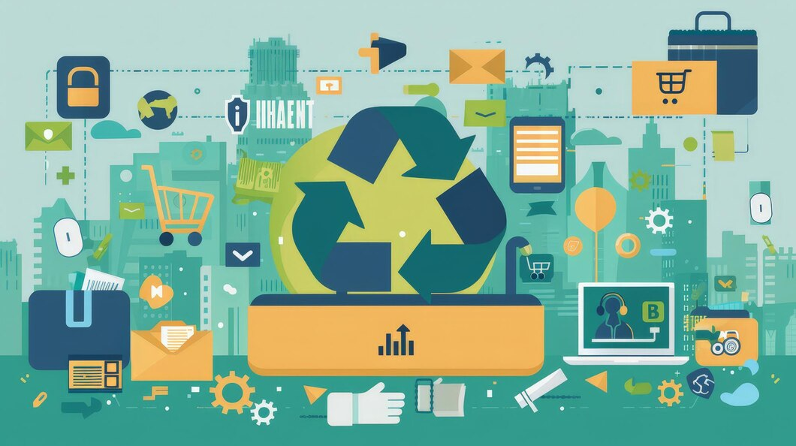

# 2.2.2 Digitalización y Tecnologías para Mitigar Impactos Negativos

## Introducción

La tecnología juega un papel crucial en la reducción de impactos negativos, permitiendo una gestión más eficiente de los recursos y mejorando la transparencia de procesos industriales. La adopción de herramientas digitales no solo optimiza el rendimiento, sino que también ayuda a cumplir con normativas ambientales y reducir la huella ecológica de las empresas.

Las innovaciones tecnológicas permiten anticipar problemas, reducir desperdicios y mejorar la sostenibilidad general del sector productivo. En este apartado, exploraremos algunas de las principales aplicaciones y beneficios de la digitalización en la mitigación de impactos negativos.

---

## Aplicaciones

Las siguientes tecnologías están transformando la manera en que las empresas gestionan sus recursos y minimizan su impacto ambiental:

- **Sensores para monitoreo ambiental** 📡: Dispositivos IoT que permiten la recolección de datos en tiempo real sobre calidad del aire, emisiones de carbono y uso del agua.
- **Redes inteligentes para eficiencia energética** ⚡: Implementación de sistemas de gestión de energía que optimizan el consumo eléctrico y reducen costos.
- **Blockchain para trazabilidad** 🔗: Uso de registros inmutables para garantizar la autenticidad y transparencia en la cadena de suministro.
- **Big Data y Analítica Predictiva** 📊: Análisis de grandes volúmenes de datos para anticipar problemas y mejorar la toma de decisiones en sostenibilidad.
- **Automatización y robótica** 🤖: Implementación de robots para reducir errores y optimizar el uso de recursos en la producción.

> "La digitalización puede hacer que la sostenibilidad sea una realidad cotidiana." - Tecnólogos

---

## Beneficios

La digitalización aporta múltiples ventajas a la gestión ambiental y empresarial:

1. **Optimización de recursos** 🌿: Uso eficiente de insumos, reduciendo desperdicios y costos operativos.
2. **Reducción de desperdicios** 🗑️: Control preciso sobre materiales y energía utilizados en procesos productivos.
3. **Mayor transparencia en la cadena de suministro** 📦: Seguimiento digital de productos desde su origen hasta el consumidor final.
4. **Eficiencia en la gestión de datos** 📊: Mejora en la recopilación, almacenamiento y análisis de información clave.
5. **Reducción de emisiones de carbono** 🌎: Implementación de tecnologías limpias que disminuyen la huella ambiental.
6. **Mejor cumplimiento normativo** 🏛️: Ayuda a las empresas a adaptarse a regulaciones ambientales sin afectar su competitividad.

---

## Casos de Éxito

### 🌱 Agricultura Inteligente
La aplicación de sensores IoT en la agricultura permite monitorear la humedad del suelo y optimizar el uso del agua, reduciendo el desperdicio y aumentando la productividad de los cultivos.

### 🏭 Industria 4.0
Empresas manufactureras han reducido su consumo energético en un 30% mediante la integración de redes inteligentes y sistemas de automatización en sus procesos.

### 🚗 Movilidad Sostenible
Las ciudades están adoptando plataformas digitales para gestionar el tráfico y promover el uso del transporte público eficiente, reduciendo así la contaminación y la congestión vehicular.

---

🔙 [Volver al índice principal](2_Riesgos_y_oportunidades_asociados_a_los_ODS_más_relevantes_de_Nuestro_Sector_Productivo_nuño.md)
⬅️ [Anterior: Identificación de riesgos](2.2.1._Integración_de_la_economía_circular_como_ventaja_competitiva_nuño.md)
➡️ [Siguiente: Digitalización](../4_capitulo4_ra3_pisa3_D_nuño/4_Modelo_de_producción_y_consumo_actual_nuño.md)

---

[^4]: Fuente: Informe de Transformación Digital 2024.