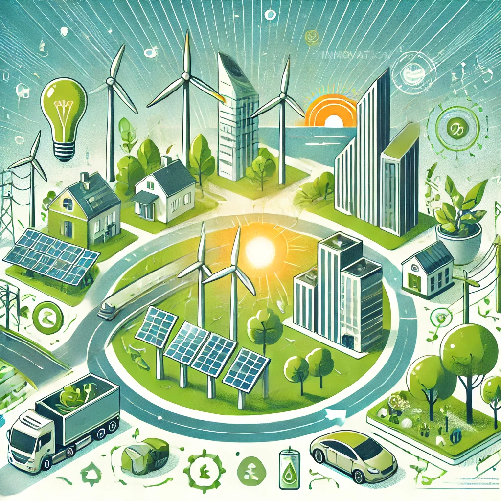

# 2.2 Oportunidades de Mejora e Innovación Sostenible

## Introducción
La sostenibilidad y la innovación son claves para el desarrollo empresarial y social.

---
## Economía Circular
- **Reutilización y reciclaje** 🔄
- **Reducción de desperdicios** 🗑️
- **Uso eficiente de materiales** 🏭

> "La economía circular es el futuro del crecimiento sostenible." - Expertos en sostenibilidad

## Digitalización y Tecnología
1. **Automatización de procesos** 🤖
2. **Optimización energética** ⚡
3. **Monitoreo en tiempo real** 📊

### Beneficios
- Reducción de costos 💰
- Mayor eficiencia operativa ⚙️
- Impacto ambiental reducido 🌱

---
🔙 [Volver al índice principal](2_Riesgos_y_oportunidades_asociados_a_los_ODS_más_relevantes_de_Nuestro_Sector_Productivo_nuño.md)
⬅️ [Anterior: Identificación de riesgos](2.1_Identificación_de_riesgos_ambientales_sociales_económicos_nuño.md)
➡️ [Siguiente: Digitalización](2.2.1._Integración_de_la_economía_circular_como_ventaja_competitiva_nuño.md)

---
## Ejemplo Práctico
| Estrategia | Beneficio | Ejemplo |
|------------|-----------|---------|
| Economía Circular | Menos desperdicio | Reciclaje de plásticos |
| Digitalización | Mayor eficiencia | Sensores inteligentes |

[^2]: Fuente: Revista de Innovación Sostenible 2024.

---