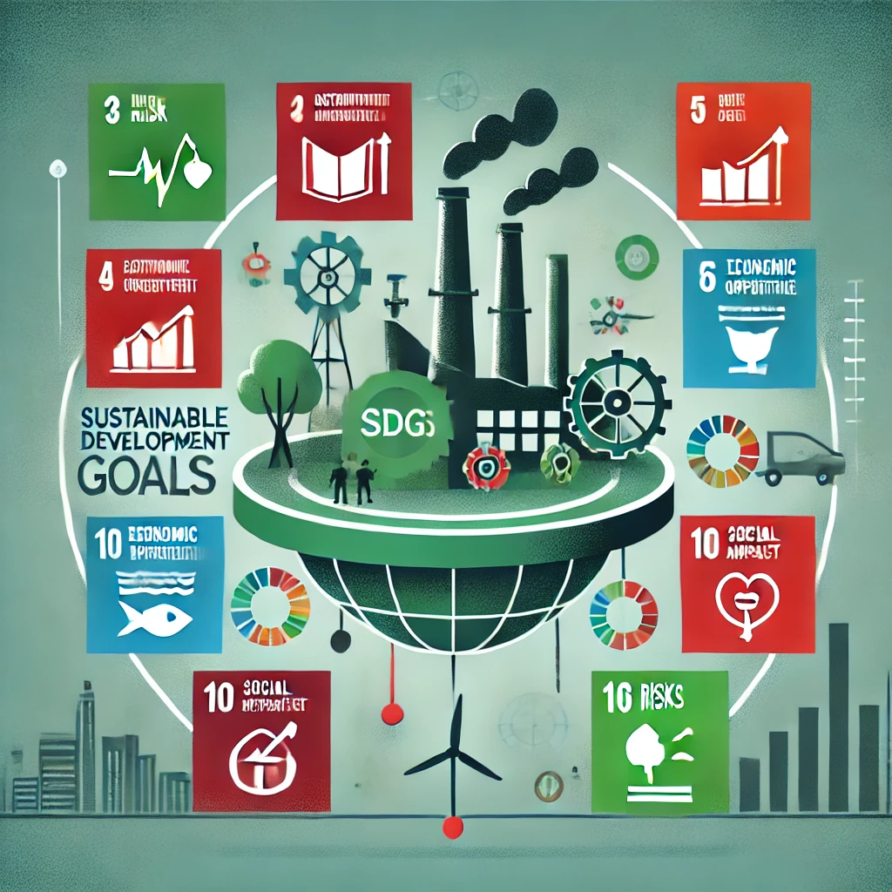

# Riesgos y Oportunidades Asociados a los ODS

## 2.0 Introducción

Los **Objetivos de Desarrollo Sostenible (ODS)** establecen un marco global para abordar desafíos ambientales, sociales y económicos. En nuestro sector productivo, la identificación de riesgos y oportunidades es clave para garantizar la sostenibilidad y competitividad. 

El propósito de este documento es analizar los principales **riesgos ambientales, sociales y económicos**, así como explorar oportunidades innovadoras que favorezcan la integración de la **economía circular** y la digitalización en nuestras estrategias empresariales.

> "Un enfoque sostenible no solo es una obligación moral, sino una ventaja estratégica para las empresas del futuro."

🔗 Para más información sobre los ODS, consulta la página oficial de la ONU: [Objetivos de Desarrollo Sostenible](https://sdgs.un.org/goals).

