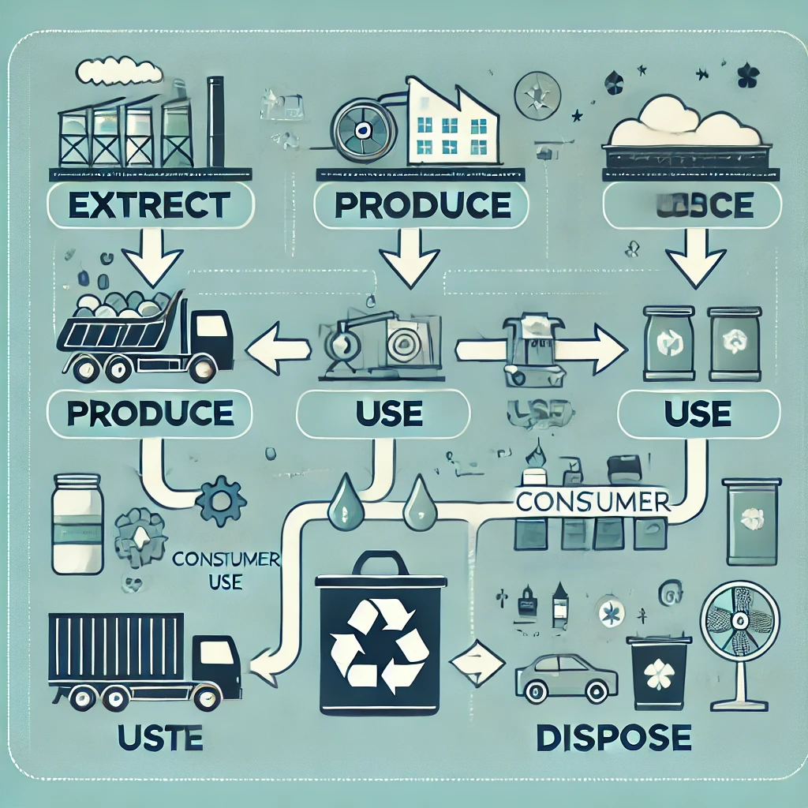

# 4.1. Caracterización del modelo lineal: "extraer, producir, usar y tirar"

## Introducción
El modelo lineal se caracteriza por su enfoque de **"extraer, producir, usar y tirar"**. Este enfoque ha sido el estándar en la industria, pero presenta graves problemas de sostenibilidad.

### Características principales
1. **Extracción**: Se extraen recursos naturales de manera intensiva.
2. **Producción**: Se fabrican productos sin considerar su impacto ambiental.
3. **Uso**: Los productos tienen una vida útil limitada.
4. **Tirar**: Los productos se desechan, generando grandes cantidades de residuos.

> "El modelo lineal es insostenible debido a su impacto ambiental y social." — Informe de la ONU, 2021.

---

### Imagen relevante

### Enlaces útiles
- [Informe sobre el modelo lineal](https://www.un.org)
- [Impacto ambiental](https://www.impactoambiental.com)

### Tabla de características
| Característica      | Descripción                              |
|---------------------|------------------------------------------|
| Extracción          | Uso intensivo de recursos naturales      |
| Producción          | Fabricación sin considerar el impacto    |
| Uso                 | Vida útil limitada de los productos      |
| Tirar               | Generación de residuos no reciclables    |

### Nota al pie
[^nota]: Este documento se basa en el informe de la ONU sobre sostenibilidad.

### Emoji
⚠️ ¡El modelo lineal debe cambiar! 🌱
🔙 [Volver al índice principal](4_Modelo_de_producción_y_consumo_actual_nuño.md)
➡️ [Siguiente: Digitalización](4.2_Problemáticas_asociadas_al_modelo_actual_agotamiento_de_recursos_y_sobrecapacidad_nuño.md)