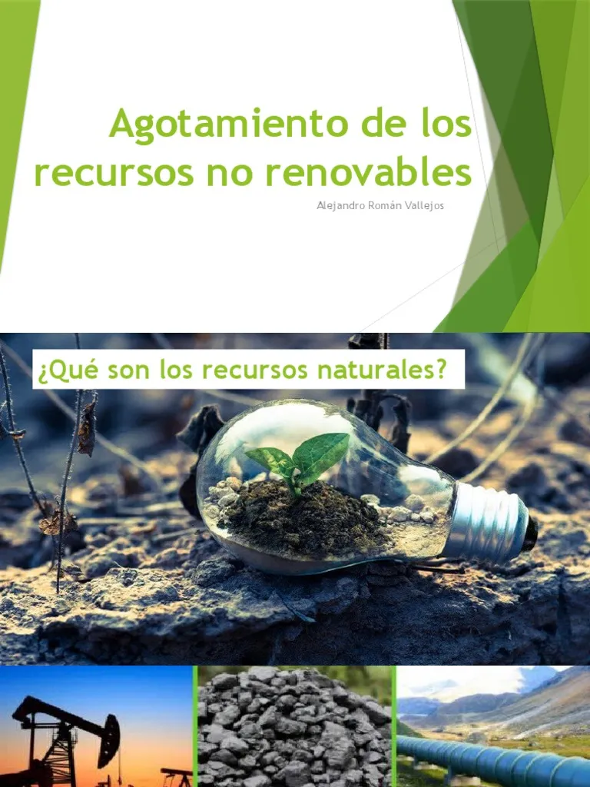

# 4.2. Problemáticas asociadas al modelo actual: agotamiento de recursos y sobrecapacidad

## Introducción
El modelo lineal de producción y consumo presenta dos problemáticas principales: el **agotamiento de recursos** y la **sobrecapacidad**.

### Agotamiento de recursos
- **Escasez de materiales**: Aumento de los costos de producción.
- **Impacto ambiental**: Degradación de ecosistemas y pérdida de biodiversidad.

### Sobrecapacidad
- **Desperdicio de recursos**: Se producen más bienes de los necesarios.
- **Contaminación**: Aumento de emisiones de CO₂ y residuos.

> "El agotamiento de recursos es una amenaza para las generaciones futuras." — Informe de la ONU, 2022.

---

### Imagen relevante

### Enlaces útiles
- [Informe sobre agotamiento de recursos](https://www.un.org)
- [Sobrecapacidad y residuos](https://www.residuos.com)

### Tabla de problemáticas
| Problemática          | Impacto                              |
|-----------------------|--------------------------------------|
| Agotamiento de recursos | Escasez de materiales, aumento de costos |
| Sobrecapacidad         | Desperdicio de recursos, contaminación |

### Nota al pie
[^nota]: Este documento se basa en el informe de la ONU sobre sostenibilidad.

### Emoji
🌍 ¡Es hora de actuar! 🌱
🔙 [Volver al índice principal](4_Modelo_de_producción_y_consumo_actual_nuño.md)
⬅️ [Anterior: Identificación de riesgos](4.1_Caracterización_del_modelo_lineal_extraer_producir_usar_y_tirar_nuño.md)
➡️ [Siguiente: Digitalización](../9_capitulo9_ra3_pisa3_D_nuño/9_Procesos_de_produccion_y_criterios_de_sostenibilidad_aplicados_nuño.md)