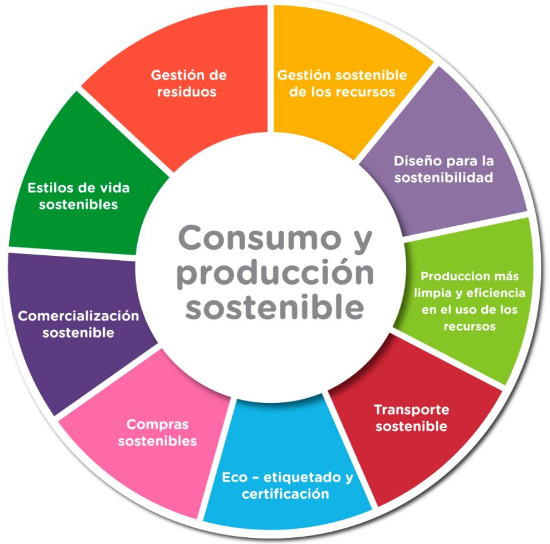

# 4. Modelo de producción y consumo actual

## Introducción
El modelo de producción y consumo actual se basa en un enfoque lineal que ha demostrado ser insostenible a largo plazo. Este documento explora las características y problemáticas asociadas a este modelo.

### Elementos clave del modelo lineal
- **Extracción**: Uso intensivo de recursos naturales.
- **Producción**: Fabricación de bienes sin considerar el impacto ambiental.
- **Consumo**: Uso de productos con vida útil limitada.
- **Desecho**: Generación de residuos no reciclables.

> "El modelo lineal es una amenaza para el medio ambiente y la sociedad." — Informe de la ONU, 2020.

---

### Enlaces útiles
- [Informe sobre el modelo lineal](https://www.un.org)
- [Alternativas sostenibles](https://www.sostenibilidad.com)

### Tabla de características
| Característica      | Descripción                              |
|---------------------|------------------------------------------|
| Extracción          | Uso intensivo de recursos naturales      |
| Producción          | Fabricación sin considerar el impacto    |
| Consumo             | Vida útil limitada de los productos      |
| Desecho             | Generación de residuos no reciclables    |

### Nota al pie
[^nota]: Este documento se basa en el informe de la ONU sobre sostenibilidad.

🌍 ¡Es hora de cambiar a un modelo más sostenible! 🌱

⬅️ [Anterior: Identificación de riesgos](../2_capitulo2_ra3_pisa3_D_nuño/2.2.2_Digitalización_y_tecnologías_para_mitigar_impactos_negativos_nuño.md)
➡️ [Siguiente: Digitalización](4.1_Caracterización_del_modelo_lineal_extraer_producir_usar_y_tirar_nuño.md)