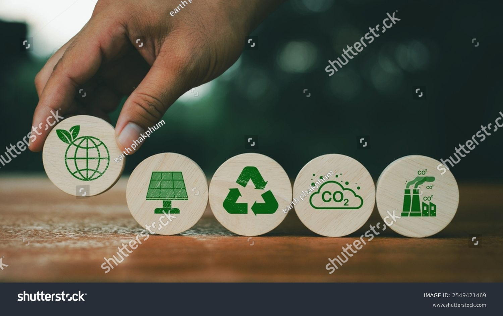

# 5.2. Economía Verde y Azul frente al Modelo Clásico 🌿🌊

La **economía verde** y la **economía azul** son enfoques que buscan integrar el crecimiento económico con la sostenibilidad ambiental. Sin embargo, cada una de estas economías tiene un enfoque particular:

## Economía Verde 🌱

La **economía verde** busca transformar las actividades económicas tradicionales hacia modelos sostenibles que prioricen:

- **Uso de energías renovables** como la solar, eólica o geotérmica.
- **Reducción de emisiones de carbono** mediante tecnologías limpias.
- **Preservación de recursos naturales**, especialmente en sectores como la agricultura y la industria.

**Ventajas principales**:

- Disminución de la contaminación ambiental.
- Creación de empleos sostenibles en sectores como energías renovables y reciclaje.
- Incremento de la resiliencia ante el cambio climático.

> **"La economía verde permite un crecimiento económico inclusivo sin comprometer el futuro del planeta."**  
> *— PNUMA (Programa de las Naciones Unidas para el Medio Ambiente)*

---

## Economía Azul 🌊

La **economía azul** aprovecha de manera sostenible los recursos oceánicos y costeros, garantizando la preservación de los ecosistemas marinos. Sus principales áreas de acción incluyen:

- **Pesca responsable**: Minimizar el impacto ambiental de las actividades pesqueras.
- **Energías limpias marinas**: Promoción de fuentes de energía como la eólica marina y las mareas.
- **Conservación de ecosistemas**: Protección de arrecifes de coral, manglares y biodiversidad marina.

> **"La economía azul aprovecha el potencial de los océanos, sin comprometer la biodiversidad ni los ecosistemas."**  
> *— Banco Mundial*

**Ejemplo práctico**:  
Un caso exitoso es el desarrollo de tecnologías para capturar energía de las olas, un recurso renovable que tiene el potencial de suplir grandes demandas energéticas sin dañar el medio ambiente.

---

## Comparación con el modelo clásico 🏭

El **modelo clásico** de economía, basado únicamente en el crecimiento económico, prioriza la producción y el consumo sin considerar los impactos ambientales. En cambio:

- La **economía verde** incorpora estrategias sostenibles para reducir el impacto ambiental en tierra firme.
- La **economía azul** se enfoca en la protección y el aprovechamiento responsable de los recursos marinos.

Ambos modelos reconocen que la prosperidad económica no debe estar reñida con la salud del planeta. Más información sobre sostenibilidad marina está disponible en este artículo del [Banco Mundial](https://www.worldbank.org/en/topic/oceans).

---

### Notas Finales

[1]: La economía azul está documentada en los reportes del Banco Mundial.

[2]: Las energías renovables son clave para el éxito de la economía verde y azul.

---
[Índice](../indice_pisa3_D_Almodovar.md)

[Punto 5](./5_Principios_de_la_economía_verde_y_circular_Almodovar.md)
