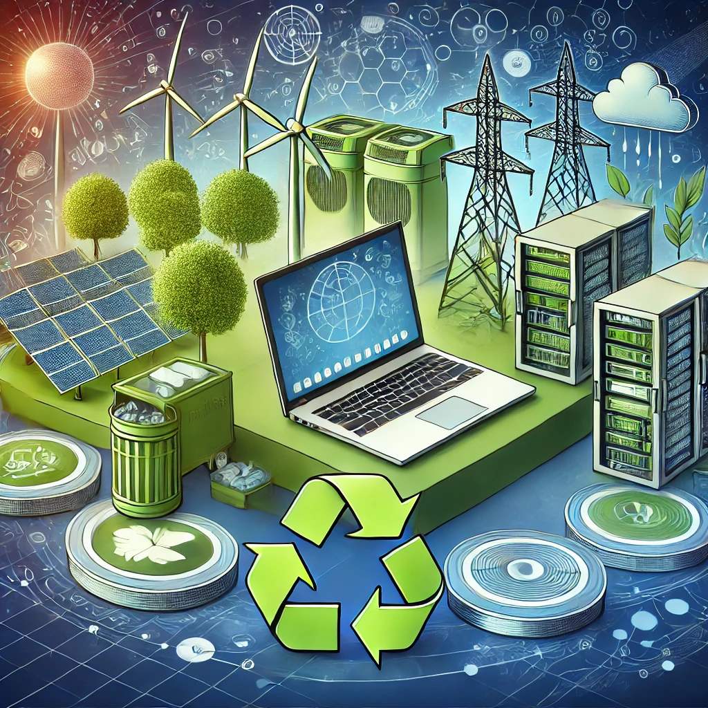

# 🌟 **7.2.1 Ejemplos de Ecodiseño Aplicados a Nuestro Sector Productivo**

## 🌐 **7.2.1.1 Ecodiseño en la Industria de la Informática y las Comunicaciones**

> *"La sostenibilidad en la tecnología es clave para el futuro digital."*

El **sector de la informática y las comunicaciones** ha adoptado el ecodiseño para reducir el impacto ambiental y mejorar la eficiencia de los productos tecnológicos.

### ✨ **Principales estrategias en nuestro sector**
1. 📦 **Diseño de hardware sostenible** con materiales reciclables y componentes reparables.
2. 🔋 **Optimización energética** en servidores, dispositivos móviles y centros de datos.
3. ♻ **Reciclaje y reutilización** de equipos electrónicos para reducir la basura tecnológica.
4. 🌱 **Uso de energías renovables** en infraestructuras tecnológicas.

---

## 🛠 **7.2.1.2 Casos de éxito en Informática y Comunicaciones**
- 📱 **Fairphone:** Un smartphone modular y sostenible con piezas reemplazables.
- 🌍 **Google Data Centers:** Infraestructura eficiente con un 50% de energía renovable.
- 💻 **HP & Dell:** Programas de reciclaje de hardware y reducción de residuos electrónicos.

---

---

💡 *El sector tecnológico puede liderar el cambio hacia una economía más circular y sostenible.* 🌍♻

⬅ [Anterior Página](//7_capitulo7_ra3_pisa3_D_Gilabert1/7.2_Ejemplos_de_ecodiseño_aplicados_a_sectores_específicos.md) | 📖 [Índice](indice_pisa3_D_Gilabert1.md)
