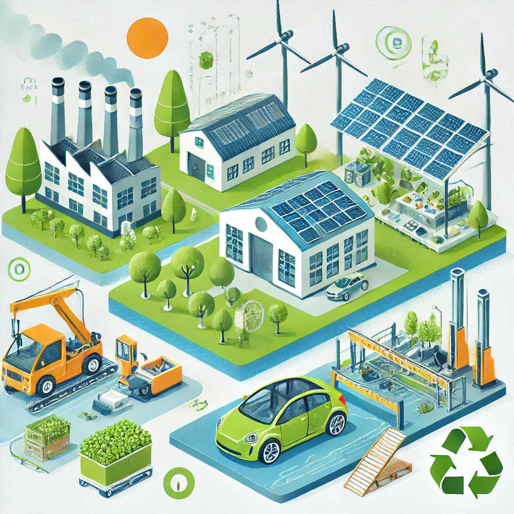

# 🌍 **7.2 Ejemplos de Ecodiseño Aplicados a Sectores Específicos**

## 📌 **7.2.1 Aplicación del Ecodiseño en Diferentes Sectores**

> *"Cada industria tiene la responsabilidad de diseñar productos con menor impacto ambiental."*

El **Ecodiseño** se ha implementado en múltiples sectores para mejorar la sostenibilidad y reducir la huella ecológica.

### 🔧 **Ejemplos en sectores específicos**
1. **🏗 Construcción:**  
   - Uso de materiales reciclados y biodegradables en edificaciones.
   - Incorporación de energía renovable y eficiencia energética.
  
2. **📱 Tecnología:**  
   - Desarrollo de dispositivos con piezas reemplazables y reciclables.
   - Reducción del consumo energético en la fabricación de hardware.
  
3. **🚗 Automoción:**  
   - Producción de vehículos con componentes reciclados.
   - Diseño de baterías reutilizables en coches eléctricos.
  
4. **👕 Moda:**  
   - Fabricación de ropa con materiales orgánicos y reciclados.
   - Reducción del desperdicio textil en los procesos de producción.

---

---

💡 *Cada sector puede contribuir al ecodiseño mediante prácticas más sostenibles.* 🌱♻

⬅ [Anterior Página](//7_capitulo7_ra3_pisa3_D_Gilabert1/7.1_Diseño_para_la_circularidad_maximizar_la_vida_útil_y_reducir_residuos.md) | 📖 [Índice](indice_pisa3_D_Gilabert1.md) | [Siguiente Capítulo ➡](//7_capitulo7_ra3_pisa3_D_Gilabert1/7.2.1_Ejemplos_de_ecodiseño_aplicados_a_Nuestro_Sector_Productivo.md)
