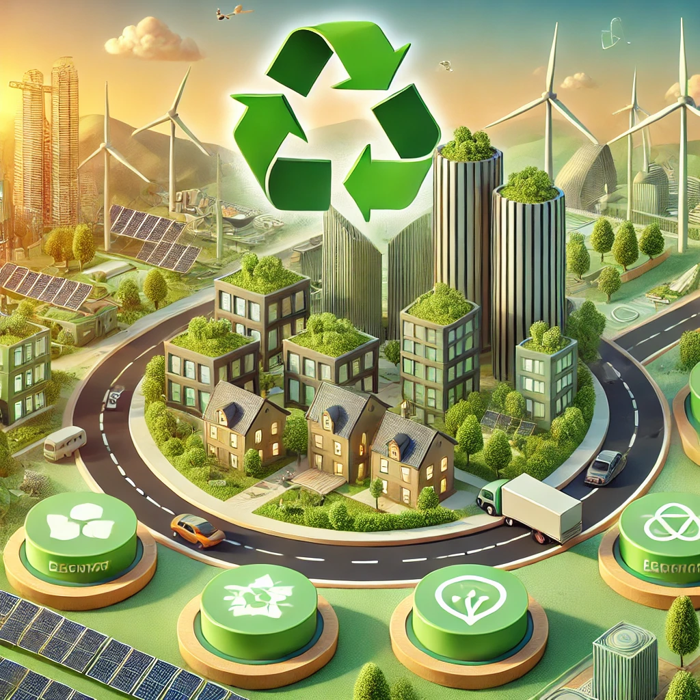

# 🌱 **Ecodiseño: Principios y Aplicación**

## 🌍 **1.1 ¿Qué es el Ecodiseño?**

> *"Diseñar para el planeta es diseñar para el futuro."*

El **Ecodiseño** es una metodología que busca integrar criterios **ambientales y de sostenibilidad** desde la fase inicial de diseño de productos o servicios. Su objetivo es reducir el impacto ambiental **sin comprometer la calidad o funcionalidad**.

### ✨ **Principios del Ecodiseño**  
1. 🌿 **Uso eficiente de materiales y energía** para minimizar el consumo de recursos.
2. 🔄 **Optimización del ciclo de vida** desde la fabricación hasta la reutilización o reciclaje.
3. 🚯 **Reducción de residuos y contaminación** mediante diseños sostenibles.
4. 🏭 **Procesos de producción responsables** con menor impacto ambiental.
5. 💡 **Innovación en materiales** promoviendo el uso de recursos reciclables o biodegradables.

---

## 🛠 **1.2 Aplicación del Ecodiseño en la Industria**
El **Ecodiseño** se aplica en diferentes sectores para mejorar la sostenibilidad:

- 🏗 **Construcción**: Edificios eficientes en consumo energético con materiales ecológicos.
- 📱 **Tecnología**: Fabricación de dispositivos con materiales reciclables y menor consumo energético.
- 🚗 **Automoción**: Vehículos eléctricos con componentes reciclables.
- 👕 **Moda Sostenible**: Uso de textiles ecológicos y reciclables para reducir el impacto ambiental.

---

💡 *El Ecodiseño no solo protege el medio ambiente, sino que también impulsa la innovación y eficiencia en las industrias.* 🌱

📖 [Índice](indice_pisa3_D_Gilabert1.md) | [Siguiente Capítulo ➡](//7_capitulo7_ra3_pisa3_D_Gilabert1/7.1_Diseño_para_la_circularidad_maximizar_la_vida_útil_y_reducir_residuos.md)
