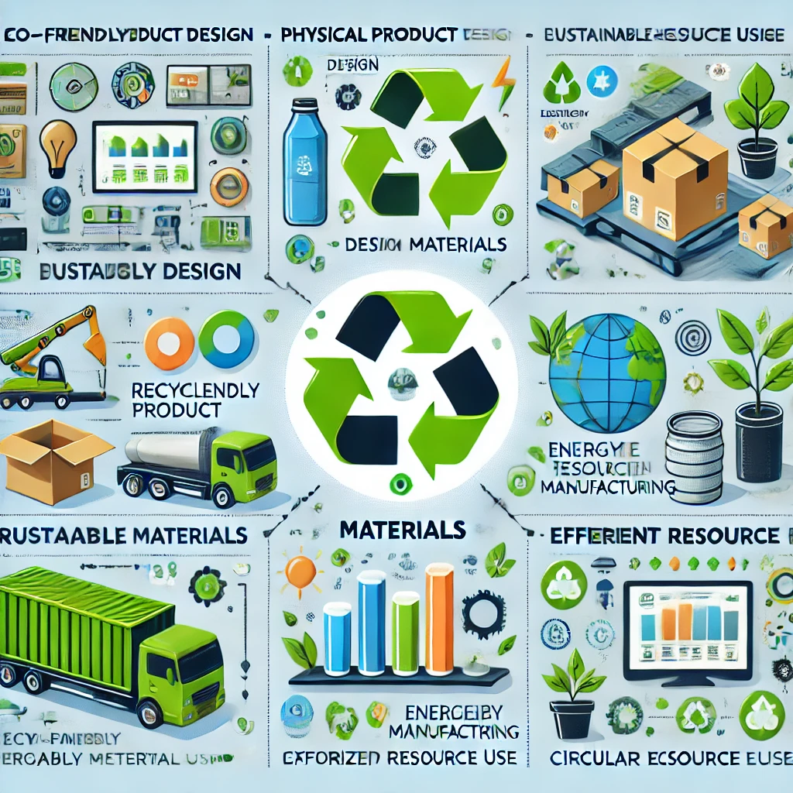

# 9.2. Sostenibilidad en procesos de productos lógicos: optimización energética y reducción de obsolescencia

## Introducción
La sostenibilidad en los productos lógicos (software, servicios digitales) se enfoca en la **optimización energética** y la **reducción de obsolescencia**.

### Optimización energética
- **Eficiencia del código**: Reducir el consumo de energía en servidores y dispositivos.
- **Tecnologías verdes**: Usar servidores y hardware eficientes.

### Reducción de obsolescencia
- **Compatibilidad**: Crear software compatible con hardware antiguo.
- **Actualizaciones ligeras**: Ofrecer actualizaciones que no requieran hardware nuevo.

> "La tecnología debe ser una herramienta para la sostenibilidad, no un obstáculo." — Bill Gates

---

### Imagen relevante

### Enlaces útiles
- [Guía de software sostenible](https://www.softwareverde.org)
- [Reducción de obsolescencia](https://www.obsolescenciaprogramada.com)

### Tabla de acciones
| Acción                | Beneficio                              |
|-----------------------|----------------------------------------|
| Optimización de código | Reduce el consumo de energía           |
| Compatibilidad        | Extiende la vida útil del hardware     |
| Actualizaciones ligeras | No obliga a cambiar hardware           |

### Nota al pie
[^nota]: Más información en el informe de Greenpeace sobre tecnología sostenible.

### Emoji
💻 ¡La tecnología también puede ser verde! 🌐
🔙 [Volver al índice principal](9_Procesos_de_produccion_y_criterios_de_sostenibilidad_aplicados_nuño.md)
⬅️ [Anterior: Identificación de riesgos](9.1_Sostenibilidad_en_procesos_de_productos_físicos_diseño_materiales_y_uso_eficiente_de_recursos_nuño.md)
