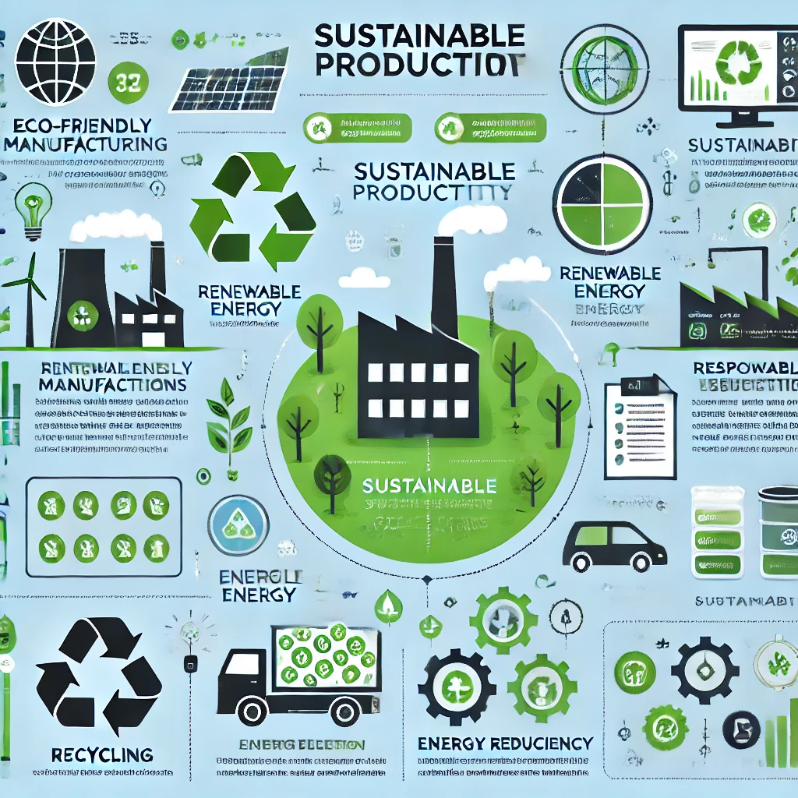

# 9. Procesos de producción y criterios de sostenibilidad aplicados

## Introducción
Los procesos de producción deben incorporar criterios de sostenibilidad para minimizar su impacto ambiental. Este documento explora cómo se pueden aplicar estos criterios en productos físicos y lógicos.

### Criterios de sostenibilidad
- **Diseño sostenible**: Crear productos duraderos y reparables.
- **Uso eficiente de recursos**: Minimizar el consumo de energía y agua.
- **Reducción de residuos**: Implementar prácticas de reciclaje y reutilización.

> "La sostenibilidad es clave para el futuro de la industria." — Ellen MacArthur

---

### Imagen relevante

### Enlaces útiles
- [Guía de sostenibilidad](https://www.sostenibilidad.org)
- [Criterios de diseño sostenible](https://www.disenosostenible.com)

### Tabla de criterios
| Criterio              | Descripción                              |
|-----------------------|------------------------------------------|
| Diseño sostenible     | Productos duraderos y reparables         |
| Uso eficiente de recursos | Minimiza el consumo de energía y agua   |
| Reducción de residuos | Reciclaje y reutilización                |

### Nota al pie
[^nota]: Más información en el informe de la ONU sobre sostenibilidad.

### Emoji
♻️ ¡El futuro es sostenible! 🌿

⬅️ [Anterior: Identificación de riesgos](../4_capitulo4_ra3_pisa3_D_nuño/4.2_Problemáticas_asociadas_al_modelo_actual_agotamiento_de_recursos_y_sobrecapacidad_nuño.md)
➡️ [Siguiente: Digitalización](9.1_Sostenibilidad_en_procesos_de_productos_físicos_diseño_materiales_y_uso_eficiente_de_recursos_nuño.md)